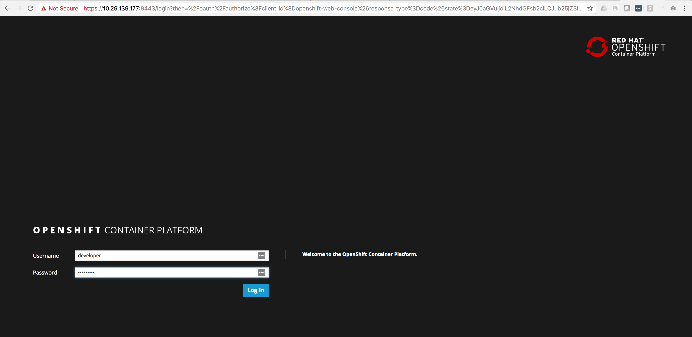

# How to deploy OpenShift on Fedora 27 (oc cluster up)

### Docker Install
First thing we need to do is get Docker up and running and configured on Fedora

* This will get docker installed: 
  ```
  [phil@c3po ~]$ sudo dnf install docker -y
  ```
* Configure the Docker daemon with an insecure registry of `172.30.0.0/16`
   - In Fedora, edit the `/etc/containers/registries.conf` file and add the following lines:
     ```
     [registries.insecure]
     registries = ['172.30.0.0/16']
     ```

* After editing the config, restart the Docker.
     ```
     $ sudo systemctl restart docker
     ```

* It's handy if you regular user is a part of the Docker group so you don't need to be root to run Docker commands
    ```
    sudo usermod -a -G docker username
    ```

*  Ensure that your firewall allows containers access to the OpenShift master API (8443/tcp) and DNS (53/udp) endpoints.
   In Fedora, you can create a new firewalld zone to enable this access:
   - Determine the Docker bridge network container subnet:
```
docker network inspect -f "{{ range .IPAM.Config }}{{ .Subnet }}{{ end }}" bridge
```

     You should get a subnet like: ```172.17.0.0/16```

   - Create a new firewalld zone for the subnet and grant it access to the API and DNS ports:
     ```
     firewall-cmd --permanent --new-zone dockerc
     firewall-cmd --permanent --zone dockerc --add-source 172.17.0.0/16
     firewall-cmd --permanent --zone dockerc --add-port 8443/tcp
     firewall-cmd --permanent --zone dockerc --add-port 53/udp
     firewall-cmd --permanent --zone dockerc --add-port 8053/udp
     firewall-cmd --reload
     ```
### OpenShift Client

*  Download the Linux `oc` binary from
   [openshift-origin-client-tools-VERSION-linux-64bit.tar.gz](https://github.com/openshift/origin/releases)
   and place it in your path.

* We're going to bring OpenShfit up not on your local `127.0.0.1` adress, you'll have issues using local address

  - Let's find your local IP Address, in my case my ip address is `10.0.10.79`
    ```
    [phil@c3po docker]$ ip a
    1: lo: <LOOPBACK,UP,LOWER_UP> mtu 65536 qdisc noqueue state UNKNOWN group default qlen 1000
    link/loopback 00:00:00:00:00:00 brd 00:00:00:00:00:00
 
    2: wlp2s0: <BROADCAST,MULTICAST,UP,LOWER_UP> mtu 1500 qdisc mq state UP group default qlen 1000
    link/ether 60:f6:77:31:83:fa brd ff:ff:ff:ff:ff:ff
    inet 10.0.10.79/24 brd 10.0.10.255 scope global dynamic wlp2s0
    ```

* Run this command to bring up OpenShift 
  ```
  [phil@c3po docker]$ oc cluster up --public-hostname 10.0.10.79
  Starting OpenShift using openshift/origin:v3.7.1 ...
  OpenShift server started.

  The server is accessible via web console at:
    https://10.0.10.79:8443

  You are logged in as:
    User:     developer
    Password: <any value>

  To login as administrator:
    oc login -u system:admin
  ```
* Go ahead and make sure you can login to your cluster
  ```
  [phil@c3po docker]$ oc login -u system:admin
  Logged into "https://10.0.10.79:8443" as "system:admin" using existing credentials.

  You have access to the following projects and can switch between them with 'oc project <projectname>':

    default
    kube-public
    kube-system
  * myproject
    openshift
    openshift-infra
    openshift-node
  ```
  
* Let's elevate the "developer" account to be a cluster admin
  ```
  oc adm policy add-cluster-role-to-user cluster-admin developer

  cluster role "cluster-admin" added: "developer"
  ```

* Open up your browser and make sure you can login into the OpenShift WebUI




**Ok you are up and running with "oc cluster up" - Have fun...**