# How to install Docker and OpenShift on Windows 10 (oc cluster up)

Windows 10

Note: Windows 10 Pro is a prerequisite (Docker will not run on Windows 10 Home)

- Windows download URL: [https://store.docker.com/editions/community/docker-ce-desktop-windows](https://store.docker.com/editions/community/docker-ce-desktop-windows)
- Download docker

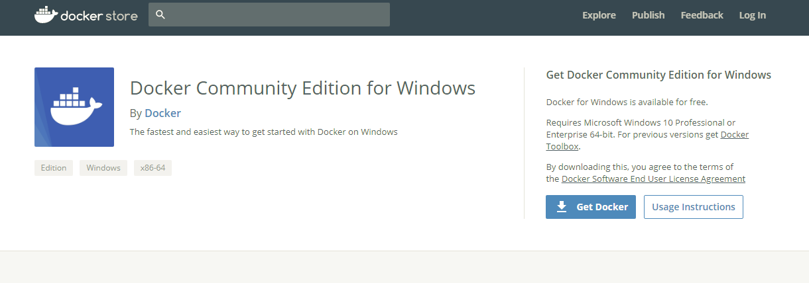

- Install Docker
  - Accept the security prompt

    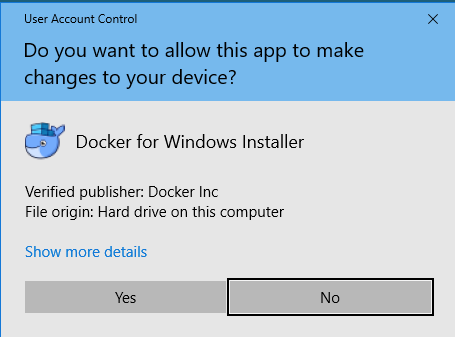

  - Option #1 - Make sure you choose option to use Linux Containers (default during the installation), Click OK
    - Note: Windows will produce an error if Windows containers are used:
      - Error: Error response from daemon: {"message":"Windows does not support privileged mode"}

    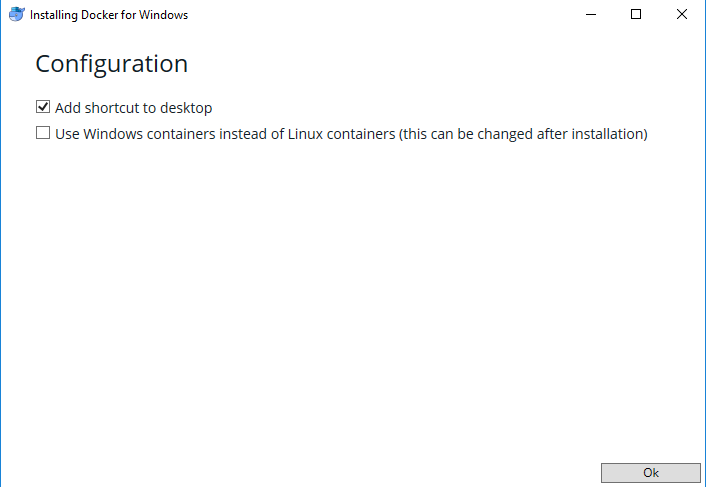

  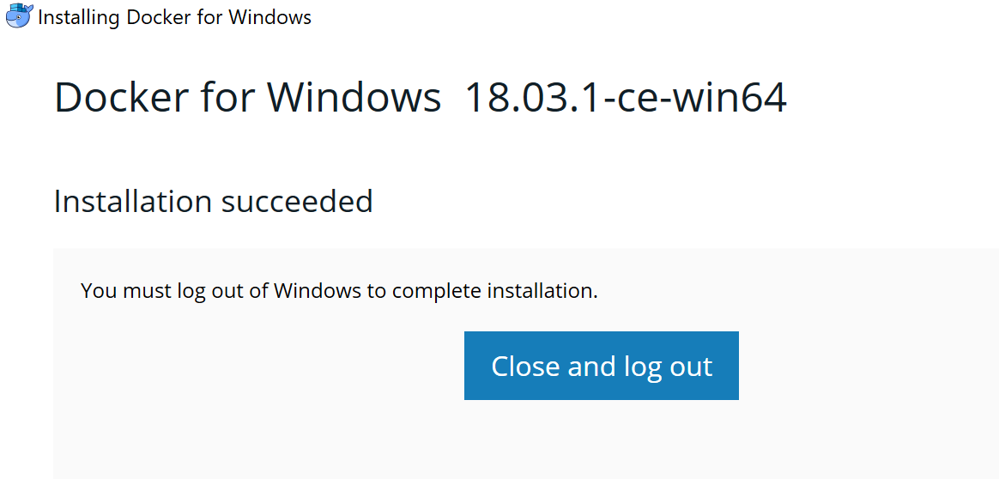

  - Once installation is complete, logo

  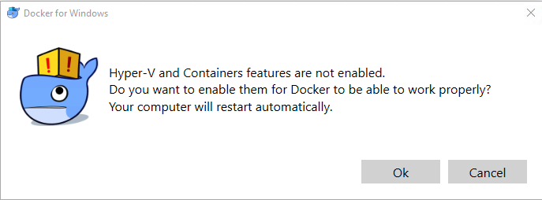

  - After logging back in, you will be prompted to perform a reboot, Click OK

  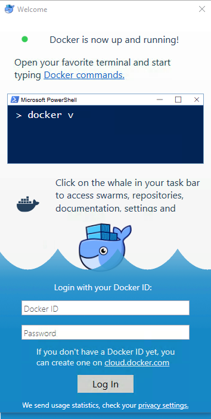

  - Reboot
  - Docker will start automatically on boot, you will see a screen like this:

    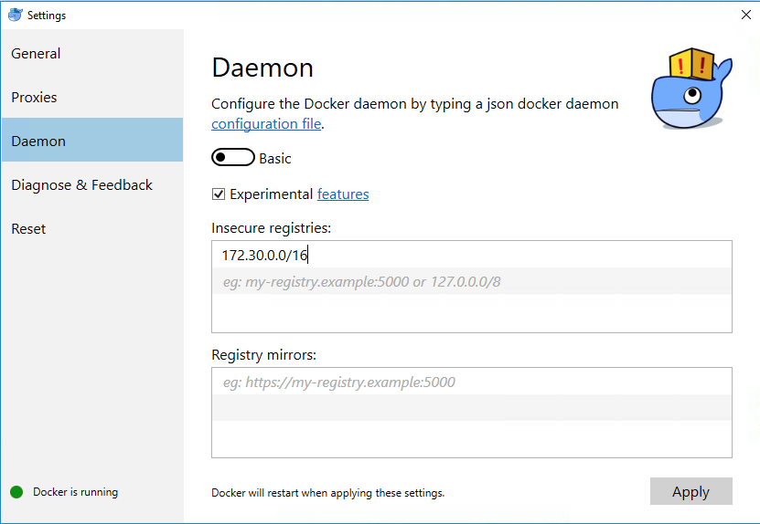

  - Ensure Docker is configured to run with Insecure Registry
    - Right click on the Docker icon in the taskbar hub, select settings
    - Click Daemon
    - Check the Experimental features box
    - Enter the subnet 172.30.0.0/16
    - Click Apply, Docker will restart

    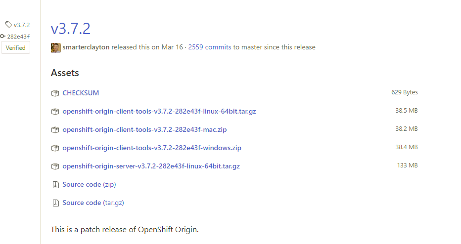

  - OC Client Tools: Next thing we need is the "OC Client Tools" - You can grab them from Red Hat here:

    [https://github.com/openshift/origin/releases/download](https://github.com/openshift/origin/releases/download/v3.9.0/openshift-origin-client-tools-v3.9.0-191fece-windows.zip)

    Download: openshift-origin-client-tools-v3.7.2-282e43f-windows.zip

    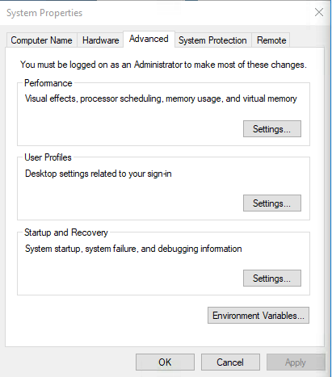

  - Installation instructions:

  [Installing OpenShift Client Tools on Windows - OpenShift Blog](https://blog.openshift.com/installing-oc-tools-windows/)

  - Extract the contents of the downloaded ZIP file to: C:\Program Files (x86)\OpenShift
  - Set the PATH variable:
    - Open the Control Panel (hit the Windows key and then type Control Panel on 8.1 and above), and click on System. Click on Advanced system settings on the left or open the Advanced tab of System Properties. Click the button labeled Environment Variables… at the bottom. Look for the option in the User variables section for Path.

      

      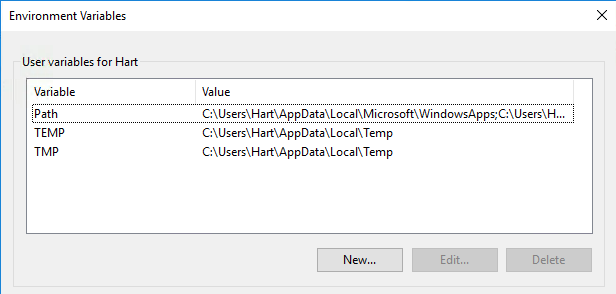

    - Click the "path" variable and click New

      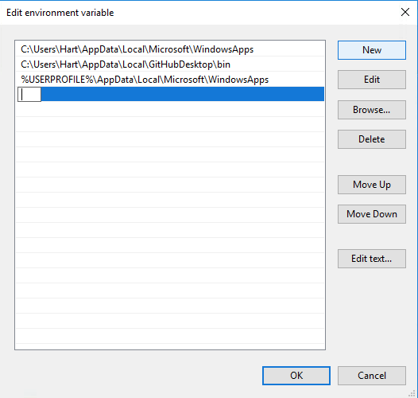

    - Enter C:\Program Files (x86)\OpenShift

      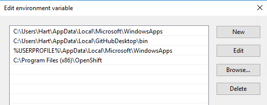

    - Click OK to save
    - Open a Command Prompt
    - Type oc version to verify the path variable is working correctly

          oc version
          oc v3.7.2+282e43f
          kubernetes v1.7.6+a08f5eeb62
          features: Basic-Auth

    - Launch the oc cluster
      - oc cluster up

            oc cluster up
            Starting OpenShift using openshift/origin:v3.7.2 ...
            Pulling image openshift/origin:v3.7.2
            Pulled 1/4 layers, 29% complete
            Pulled 2/4 layers, 50% complete
            Pulled 3/4 layers, 93% complete
            Pulled 4/4 layers, 100% complete
            Extracting
            Image pull complete
            OpenShift server started.

      - Login details

            The server is accessible via web console at:
                https://10.0.75.2:8443

            You are logged in as:
                User:     developer
                Password: <any value>

            To login as administrator:
                oc login -u system:admin

      - Make sure you can login to your cluster as admin

            oc login -u system:admin

            Logged into "https://10.0.75.2:8443" as "system:admin" using existing credentials.

            You have access to the following projects and can switch between them with 'oc project <projectname>':

                dashai
                default
                kube-public
                kube-system
              * myproject
                openshift
                openshift-infra
                openshift-node

            Using project "myproject".

      - Elevate the "developer" account to be a cluster admin

            oc adm policy add-cluster-role-to-user cluster-admin developer

            cluster role "cluster-admin" added: "developer"

    - Access the Openshift origin dashboard

    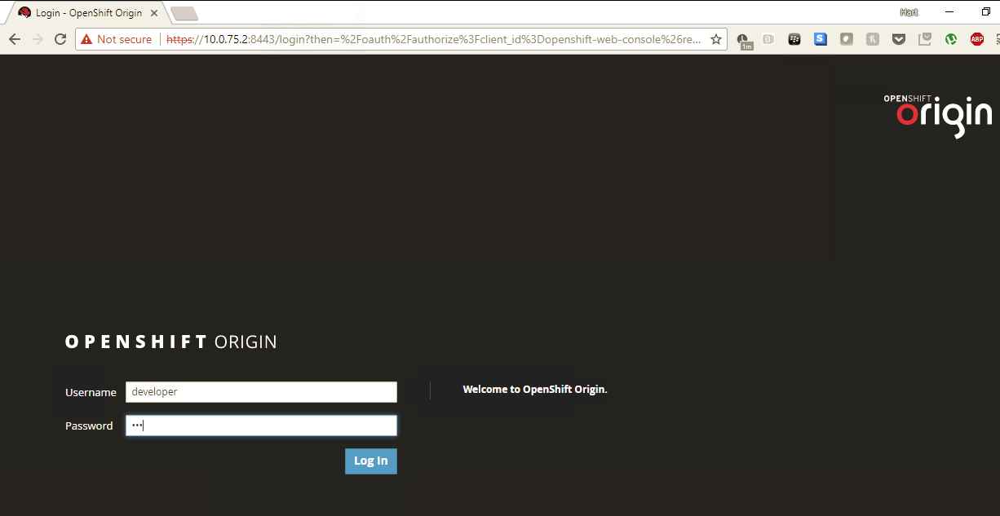

    - Dashboard

    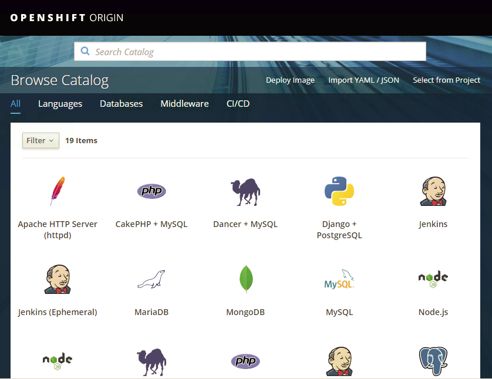

    - Before creating a project, Git must be installed on the Windows system and added to the PATH, use the following link:
      - [https://git-scm.com/download/win](https://git-scm.com/download/win)
