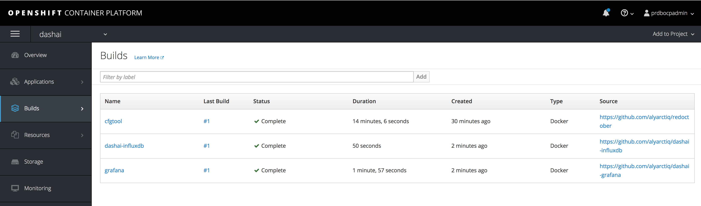

# Connect to DashAI - WebUI / Connect Cluster and Deploy Core Components

Click on the route you exposed earlier - that will open the Dashai configurator:

This will load the main page - Login:

Connect to your Cluster:

You can use your id and password (make sure to add the OpenShift URL)

You can also use the token we used above to login via OC client - **Easiest / Quickest!**

Now make sure to set the proper project (the project you just created "dashai")

You cam also select the project from the left menu - "Set Project"

Now its time to deploy base components (Influxdb and Grafana containers)

Choose "Deploy Base Components" from the left menu

Wait for the results to display

You can see the new Builds inside your OpenShift project from the WebUI:

Here are your new PODs coming online

You should have a new grafana route also:

Your base components are now deployed...

You will want to move you Influxdb and Grafana PODs to utilize Persistent Storage
This will ensure when your POD restarts you data will be maintained and available

You can go ahead and provision some storage for your PODs
In our example we have Gluster configured in our Cluster

Now let's update the deployment config's to attach our new storage

    oc volume dc/dashai-influxdb --add --overwrite --name=dashai-influxdb-volume-1 --type=persistentVolumeClaim --claim-name=influxpv

    oc volume dc/grafana --add --overwrite --name=grafana-var-lib --type=persistentVolumeClaim --claim-name=grafanapv --mount-path=/var/lib/grafana
