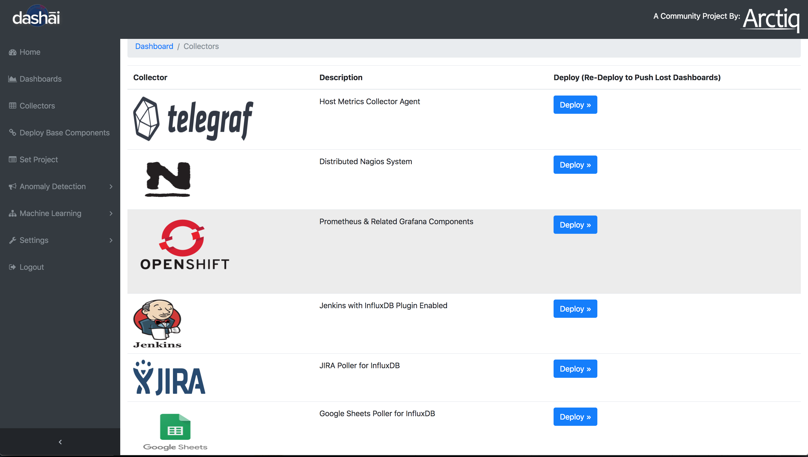
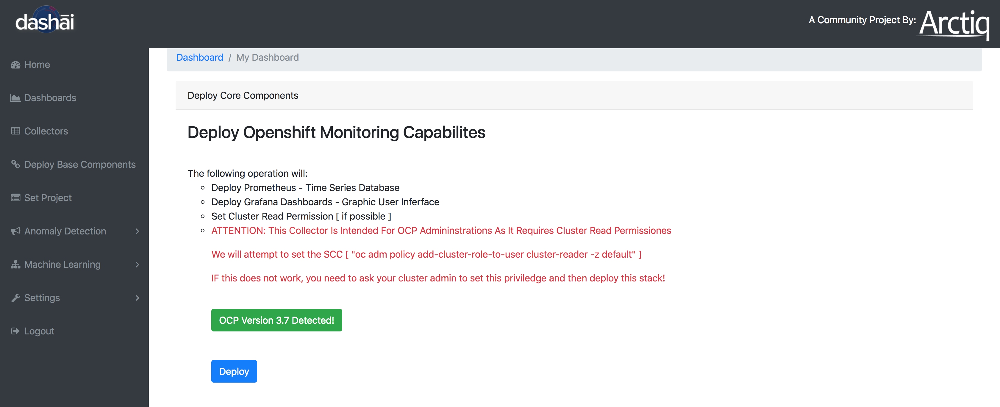
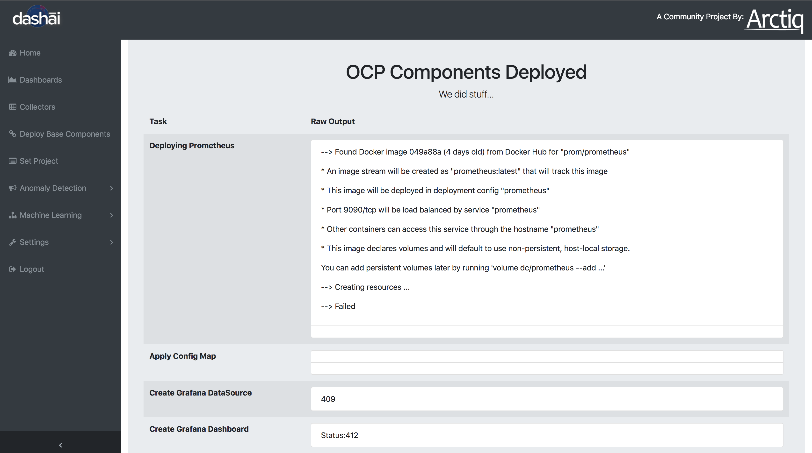
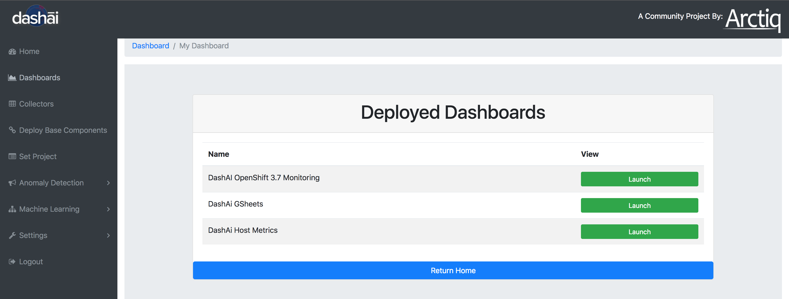
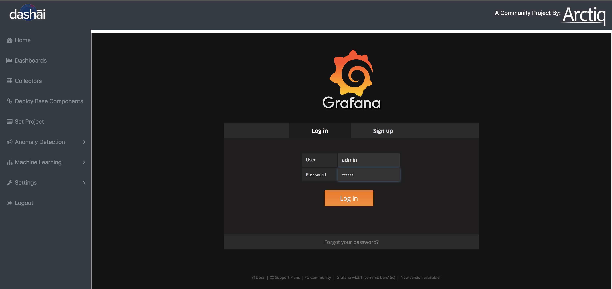
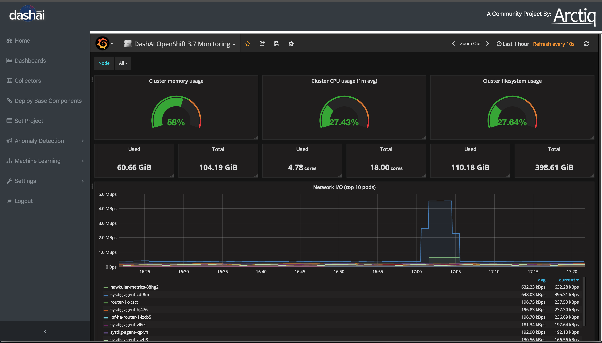
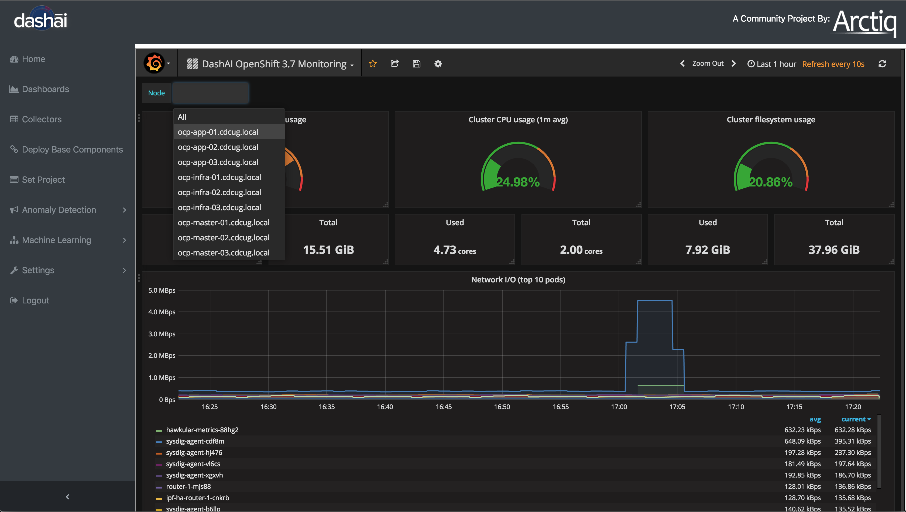
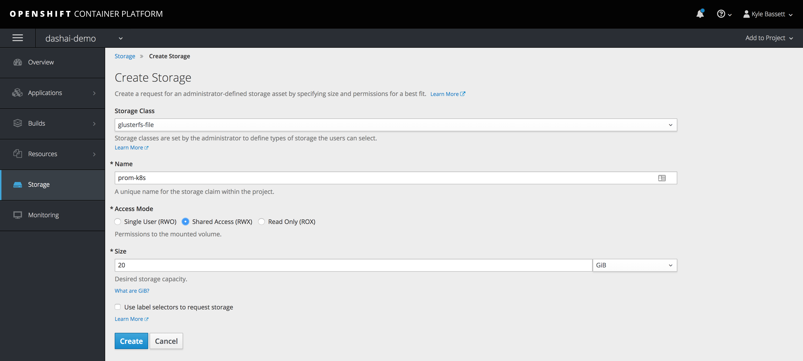

# Deploy OCP Collector - View your new Dashboard

Select Collectors from the left Dashai Menu - then choose OpenShift:

This step will deploy the OpenShift components and collector:

Wait for the status page to display:

You can monitor the new POD builds via the OpenShift WebUI - Let the deployment finish

Click on the Dashboards link on the left hand side

You will see your new Dashboard "DashAi OpenShift 3.x Monitoring" - Click "Launch"

This will launch the Grafana WebUi

Login into the Grafana WebUI - (admin - dashai) - (*You can change the password if you like)*

You will see your main OpenShift Cluster Dashboard (We loaded some baseline metrics for you)

You can select also each node in your cluster to view specific node data

Ok - you have your OpenShift cluster being monitored with dashai,

You will want to move you Prometheus POD to utilize Persistent Storage
This will ensure when your POD restarts you data will be maintained and available

You can go ahead and provision some storage for your POD
In our example we have Gluster configured in our Cluster

Now let's update the deployment config's to attach our new storage

    oc volume dc/prometheus --add --name=prom-k8s -m /etc/prometheus -t configmap --configmap-name=prom-k8s

Feel free to customize your dashboard and play with the timeline...
