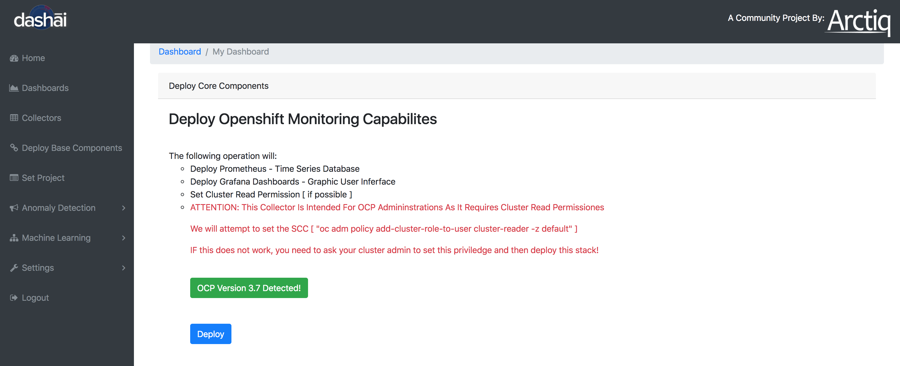
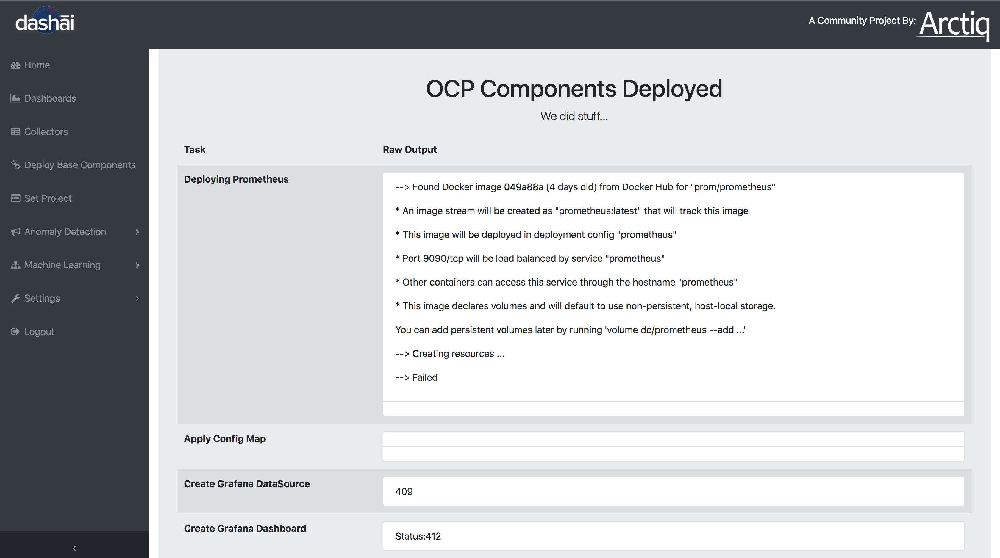
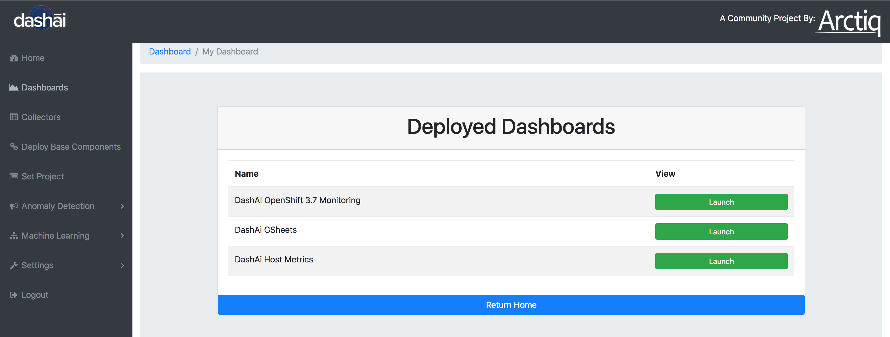

# Deploy OpenShift Collector & View Your New Dashboard

Select Collectors from the left Dashai Menu - then choose OpenShift:

This step will deploy the OpenShift components and collector:

Wait for the status page to display:

You can monitor the new POD builds via the OpenShift WebUI - Let the deployment finish

Click on the Dashboards link on the left hand side

You will see your new Dashboard "DashAi OpenShift 3.x Monitoring" - Click "Launch"

This will launch the Grafana WebUi

Login into the Grafana WebUI - (admin - dashai) - (*You can change the password if you like)*

You will see your main OpenShift Cluster Dashboard (We loaded some baseline metrics for you)

You can select also each node in your cluster to view specific node data

Ok - you have your OpenShift cluster being monitored with DashAI,

Feel free to customize your dashboard and play with the timeline...
