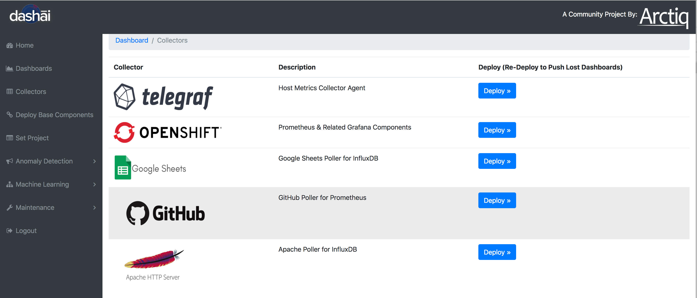

# Deploy Github Collector

Start by clicking on the left menu and selecting Collectors

Choose "Github Collector" - Hit "Deploy"

Go ahead and click "Deploy"  again

In this section we need you to provide the Github repo's you want to collect data from

Below is an example a few different repo's you can use for testing:

    dashai/dashai, openshift/origin, kubernetes/kubernetes, prometheus/prometheus, ansible/ansible, tensorflow/tensorflow

You can use your own, make sure to follow the formatting (no , after the last repo)

---

You don't need a API token for public repo's, but Github will rate limit the data collection calls. If you use an API token you won't have that limitation.

For any Private Repo you will need an API token.

Here is an example of how to create an API token inside your Github account:

Under "Settings" (top right drop down), then "Developer Settings" (bottom left menu)

Create a new "Personal Access Token" - Provide "repo" permission

Copy the token, you will use it to deploy the "Github Collector"

Enter the repo's and your token and click "Submit"

Wait for the status screen to display

You can flip over to your OpenShift project and see a new build and POD coming up

If you go into the deployment config and look at the "Environment" tab you will see the repo's and API key

If you ever want to add more repo's, you can add them at the end of the last entry

When you hit saw this will cause you new POD to redeploy and start collecting the new data

Go ahead and click on the "Dashboard" on the left side and "Launch" your Dashboard

We have loaded some default graphs for you (feel free to customize)

