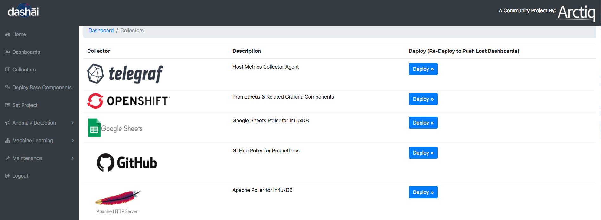
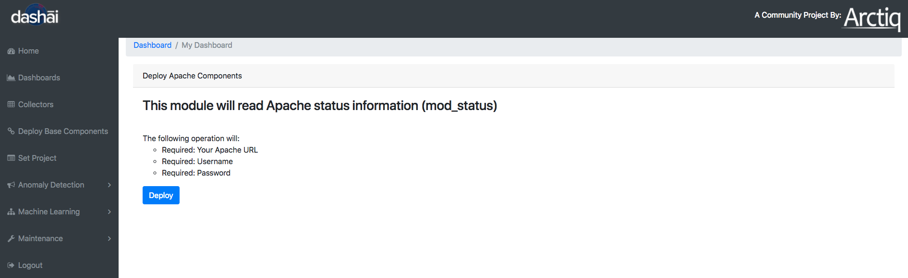
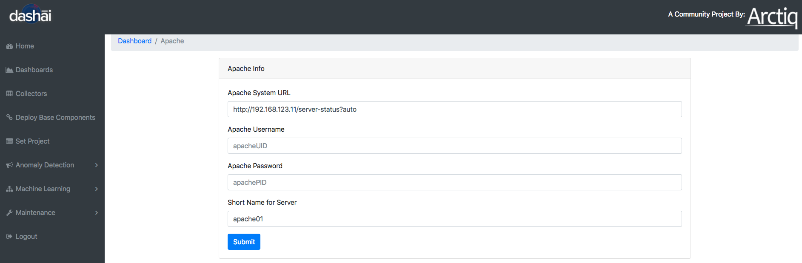
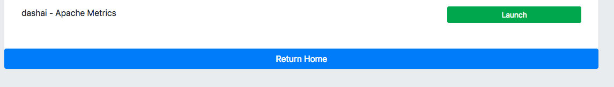
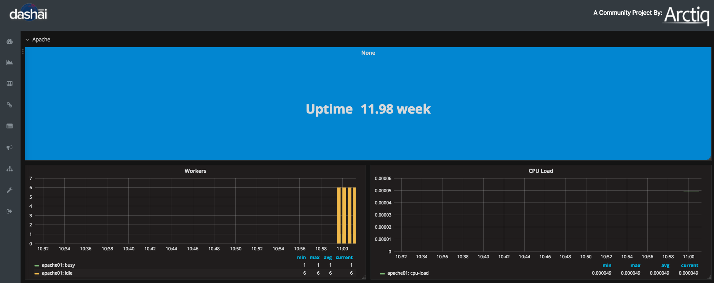
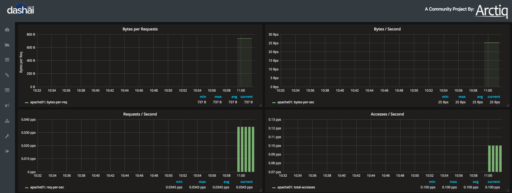
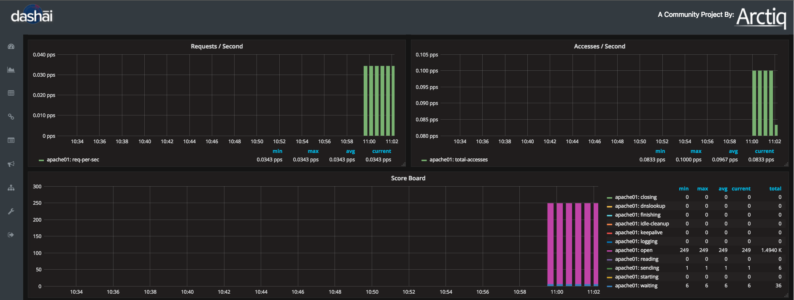

# Deploy Apache Collector

First let's configure your Apache Web Server
On your Apache server, add a section under /etc/httpd/conf.d/dashai.conf

**Without Auth**

Allow server status reports, with the URL of:

Example: http://your.server.example.com/server-status

    ExtendedStatus on
    <Location /server-status>
    SetHandler server-status
    Require valid-user
    </Location>

**With Auth**

Allow server status reports, with the URL of:

Example: http://your.server.example.com/server-status

    ExtendedStatus on
    <Location /server-status>
    SetHandler server-status
    AuthType basic
    AuthName "Apache status"
    AuthUserFile /etc/httpd/conf/server-status_htpasswd
    Require valid-user
    </Location>

***After either method, you will need to restart the apache webserver:***

    systemctl restart httpd

Choose collectors from the left hand side menu

Choose Apache Http Server

Go ahead and click deploy

Provide your server information, enter your Auth info, and short name

If you don't have Auth configured, you can leave these values blank

Submit and your collector and dashboard will be deployed

You can view your new Dashboard from the left menu "Dashboards"

Launch your Dashboard, if you are prompted form a user/pass ("admin" "dashai") is default

After a few minutes you will start to see you data being displayed in the default dashboards

Some default Dashboard views

That's it, enjoy your Apache dashboard
